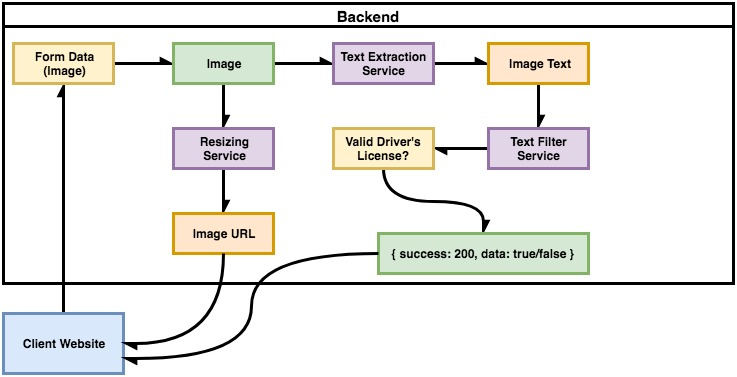

### Minimal TesseractJS Example

### Explanation of the Workflow

* Client (browser) `sends image` included in form data to the backend server
* Server receives form data, `extracts the image` (downloads the image into the virtual machine's local storage)
* Server runs a resizing process on the image, and sends back a url to the client (this feature is already done)
* Server also runs a text extraction process on the image, decides whether or not this image represents a valid driver's license, and sends back a response to the client (this feature needs to be developed)